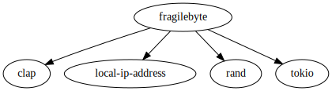

## Socket pair for FTP like file transfer

Single binary containing both server and client.

<p align="left">
<a href="https://github.com/einisto/fragilebyte/actions/workflows/ci.yml"></a>
<a href="https://github.com/einisto/fragilebyte/tags"></a>
<a href="https://opensource.org/licenses/MIT"></a>
</p>

### Installation and usage

Quickly run with:

```shell
cargo run -- <OPTIONS>
```

or create and run an optimized, independent binary:

```shell
cargo build --release
./target/release/fragilebyte <OPTIONS>
```

If no options are specified the app starts as a server by default. It can be started as a client by defining a target address:

```
USAGE:
    fragilebyte [OPTIONS]

OPTIONS:
    -b, --buffersize <BUFFERSIZE>    Buffersize used in the file transfer (bytes) [default: 8192]
    -f, --fileroot <FILEROOT>        Path to the folder where the files are outputted as a client or
                                     served from as a server [default: './output' / './data']
    -h, --help                       Print help information
        --localhost                  Run only in the local network
    -p, --port <PORT>                Port where the service is hosted [default: 8080]
    -t, --target <TARGET>            Server's address when connecting as a client
        --timeout <TIMEOUT>          Seconds of inactivity after which the server closes itself
                                     [default: 30]
    -V, --version                    Print version information
```

### Dependencies


